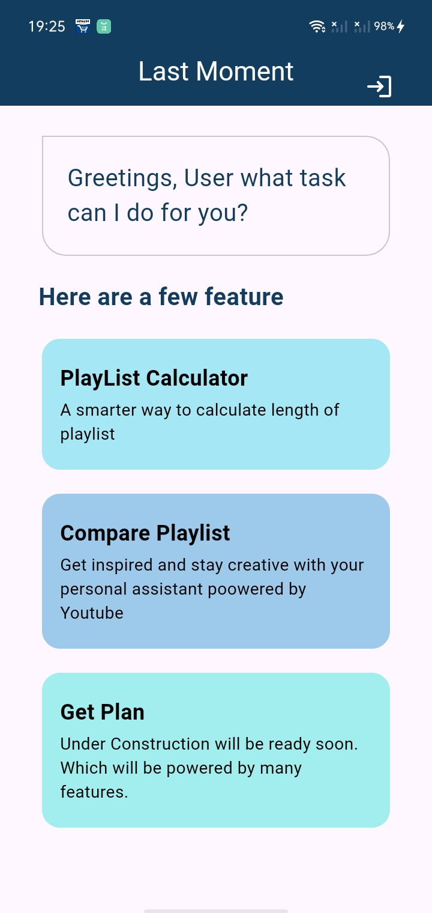
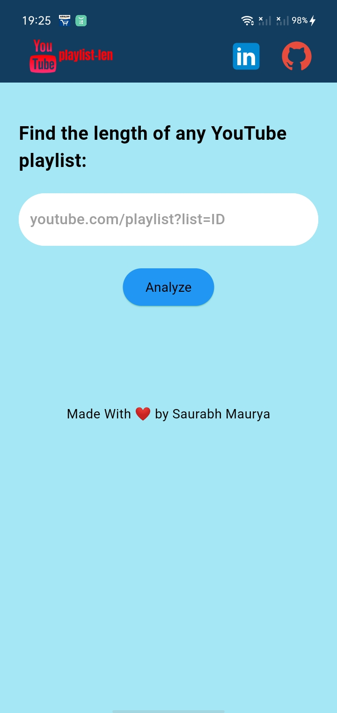
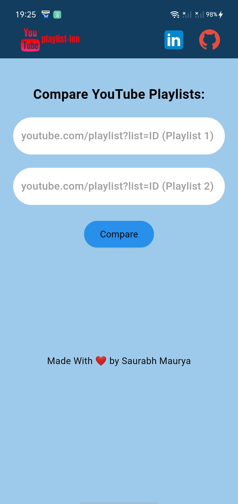

# 🎥 YouTube Playlist Length 📊

Analyze YouTube playlists and videos with ease! Get detailed information about video durations and playlist lengths.

## Screenshot

  
  

  
  

  
  

## 🌟 Features

- 📋 Analyze multiple playlists and individual videos
- ⏱️ Calculate total duration of playlists
- 🚀 Estimate playback times at different speeds (1.25x, 1.50x, 1.75x, 2.00x)
- 🔢 Support for custom playback speeds
- 📅 View average video length in playlists
- 🔍 Analyze specific video ranges within playlists

## 🚧 Future additions (if I ever get around to it) 
- [ ] Add support for asynchronous requests to speed up the process
- [ ] Add caching layer to reduce API calls
- [ ] Add more analytics related to the videos (like average views, likes, etc.)

## 👏 Technologies Used
- [Firebase](https://firebase.google.com/)
- [YouTube Data API](https://developers.google.com/youtube/v3)
- [FastAPI](https://fastapi.tiangolo.com/)
- [Flutter](https://flutter.dev/)
